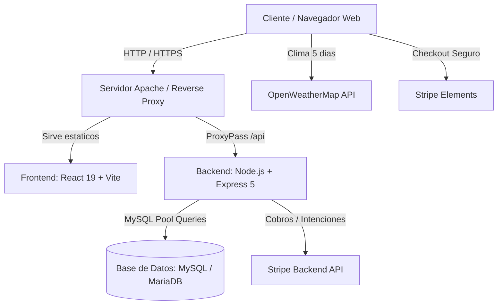

# Arquitectura General del Sistema - Hotel Aura de Mallorca

Este documento detalla la topología arquitectónica, la comunicación entre componentes y los flujos integrados del sistema.

---

## 1. Vision General

Hotel Aura de Mallorca es una plataforma web completa de gestión y reserva hotelera que consta de tres pilares arquitectónicos:

```mermaid
graph TD
    Client[Cliente / Navegador Web] -->|HTTP / HTTPS| Apache[Servidor Apache / Reverse Proxy]
    Apache -->|Sirve estaticos| Frontend[Frontend: React 19 + Vite]
    Apache -->|ProxyPass /api| Backend[Backend: Node.js + Express 5]
    Backend -->|MySQL Pool Queries| DB[(Base de Datos: MySQL / MariaDB)]
    Client -->|Clima 5 dias| ExtWeather[OpenWeatherMap API]
    Client -->|Checkout Seguro| Stripe[Stripe Elements]
    Backend -->|Cobros / Intenciones| StripeAPI[Stripe Backend API]
```

---

## 2. Componentes del Sistema

### 2.1. Frontend (`frontend/`)
- **Tecnología**: React 19, TypeScript, Vite.
- **Estilos e Interfaz**: Bootstrap 5, React-Bootstrap, React Icons, FontAwesome, animaciones Parallax.
- **Arquitectura de UI**: Orientada a componentes con modales interactivos para reducir recargas de página:
  - `BookingModal`: Asistente de reservas por pasos (8 etapas).
  - `UserModal`: Gestión de autenticación (Login, Registro con QR, Edición de perfil, Recuperación).
  - `DuplicateBookingModal`: Clonado rápido de reservas existentes.
  - `ViewImageModal`: Visualizador de imágenes de servicios y habitaciones.
- **Internacionalización**: `i18next` y `react-i18next` con detección de idioma del navegador.

### 2.2. Backend (`backend/`)
- **Tecnología**: Node.js con Express 5.
- **Punto de Entrada**: `index.js`.
- **Servicios Integrados**:
  - Autenticación JWT con validación cruzada contra la tabla `app_user`.
  - Procesamiento de imágenes y decodificación de códigos QR mediante `jsQR` y `Jimp`.
  - Almacenamiento y subida de archivos con `multer`.
  - Pasarela de pagos con el SDK oficial de `stripe`.
  - Notificaciones por correo electrónico mediante `nodemailer`.
  - Detección de cancelaciones reiteradas y control de sanciones (`userPunishmentCheck`).
  - Caché y sincronización de previsiones climáticas (`/insert-weather`, `/weather`).

### 2.3. Persistencia de Datos (`database/`)
- **Motor**: MySQL / MariaDB.
- **Esquema**: Relacional normalizado definido en `database/db.sql`.
- **Política**: El contenido de `database/` es de solo lectura en el contexto de desarrollo actual.

---

## 3. Flujos de Comunicación y Seguridad

### 3.1. Autenticación y Autorización
- Los tokens JWT se transmiten en cabeceras HTTP (`Authorization: <token>`) o vía cuerpo/cookies.
- El middleware `verifyUser` en el backend verifica no solo la firma criptográfica del JWT sino también:
  1. Que el token corresponda al campo `access_token` vigente en `app_user`.
  2. Que el usuario no este inhabilitado (`isEnabled = 1`).
  3. Que el correo este verificado (`user_verified = 1`).

### 3.2. Integración Meteorológica Única
- El hotel ofrece un mecanismo de control predictivo:
  1. En el frontend se consulta la previsión meteorológica a 5 días de Mallorca (lat: 39.5813, lon: 2.7092).
  2. La informacion se almacena en la tabla `weather` de la base de datos local vía `/insert-weather`.
  3. Durante el proceso de reserva, si las fechas seleccionadas coinciden con días de lluvia severa que afecten la experiencia de los servicios exclusivos, el sistema advierte o condiciona la reserva.

### 3.3. Sistema de Sanciones y Cancelaciones
- El backend evalua las cancelaciones del usuario (`userPunishmentCheck`).
- Si un usuario supera el umbral de reservas canceladas, su campo `isEnabled` se desactiva.
- Para su reactivacion administrativa se requiere tanto poner `isEnabled = 1` como `enabledByAdmin = 1`.
