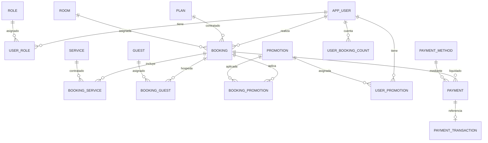

# Analisis del Modelo de Datos - Hotel Aura de Mallorca

Este documento describe la estructura relacional, tablas, restricciones y logica de persistencia contenida en `database/db.sql`.

> **AVISO IMPORTANTE**:
> El directorio `database/` y su contenido son de **estricta solo lectura**. No deben realizarse modificaciones directas en `database/db.sql` ni en sus archivos asociados.

---

## 1. Diagrama Entidad-Relacion y Relaciones

El modelo relacional garantiza la integridad referencial y modela el dominio del negocio hotelero:

---

## 2. Descripcion Detallada de Tablas

### 2.1. Usuarios, Roles y Seguridad
- **`app_user`**:
  - `id`: Identificador unico (PK, autoincremental).
  - `user_name`, `user_surnames`, `user_email` (UNIQUE), `user_dni` (UNIQUE).
  - `user_password`: Hash bcrypt de la contrasena.
  - `user_verified`: Booleano para confirmacion de email.
  - `verification_token`, `verification_token_expiry`: Token temporal de activacion.
  - `access_token`: Token JWT activo para validacion cruzada.
  - `reset_token`, `reset_token_expiry`: Gestion de recuperacion de clave.
  - `isEnabled`: Flag de estado de cuenta. Se desactiva ante sanciones.
  - `enabledByAdmin`: Flag de doble aprobacion requerida para reactivacion tras suspension.
- **`role`**:
  - `id`: PK.
  - `name`: Enumeracion (`CLIENT`, `ADMIN`, `EMPLOYEE`).
- **`user_role`**:
  - Vincula `user_id` con `role_id` (claves foraneas con eliminacion en cascada para usuario).

### 2.2. Huespedes y Capacidad
- **`guest`**:
  - Informacion de los ocupantes de las habitaciones.
  - `isAdult`: `CHAR(1)` indicando si es mayor de edad.
  - `isSystemUser`: `CHAR(1)` indicando si el huesped es un usuario registrado en `app_user`.
- **`booking_guest`**:
  - Tabla asociativa N:M entre `booking` y `guest`.

### 2.3. Catalogo Hotelero
- **`plan`**:
  - Modalidades de estancia (`Basic` a 50.00 EUR, `VIP` a 150.00 EUR).
- **`room`**:
  - Habitaciones, nombres, tarifas base y ventanas de disponibilidad (`room_availability_start`, `room_availability_end`).
- **`service`**:
  - Servicios adicionales ofrecidos (spa, traslados, cenas gourmet), tarifas y disponibilidad.

### 2.4. Reservas y Operaciones
- **`booking`**:
  - Centraliza la reserva: vincula `user_id`, `plan_id`, `room_id`.
  - Fechas: `booking_start_date`, `booking_end_date`, `cancellation_deadline`.
  - `is_cancelled`: Booleano para marcar reservas canceladas.
  - **Restricciones CHECK**:
    - `valid_dates`: `CHECK (booking_start_date <= booking_end_date)`
    - `valid_cancellation`: `CHECK (cancellation_deadline < booking_start_date)`
- **`booking_service`**:
  - N:M entre `booking` y `service`.

### 2.5. Promociones y Fidelizacion
- **`promotion`**:
  - Codigo de cupon (`code` UNIQUE), importe de descuento (`discount_price`), fechas de validez.
- **`booking_promotion`**:
  - Registra que promocion se desconto en una reserva especifica.
- **`user_promotion`**:
  - Asigna promociones directas a usuarios con control de uso unico (`isUsed`).
- **`user_booking_count`**:
  - Contador de reservas completadas por usuario, utilizado para logica de premios o castigos.

### 2.6. Meteorologia Local
- **`weather`**:
  - `weather_date`: Fecha de la observacion o prevision.
  - `weather_state`: Estado atmosferico (ej. `Rain`, `Clear`, `Clouds`).
  - Sirve como cache local para no saturar las cuotas de la API externa y permitir consultas rapidas en la comprobacion de reservas.

### 2.7. Pasarela y Transacciones de Pago
- **`payment_method`**:
  - Metodos configurados (tarjeta bancaria, pasarela digital, Stripe).
- **`payment`**:
  - Registro contable interno del importe abonado, fecha y relacion con `booking_id` y `user_id`.
- **`payment_transaction`**:
  - Almacena el `transaction_id` devuelto por Stripe u otra pasarela externa.

### 2.8. Gestion Multimedia
- **`media`**:
  - Tabla polimorfica para recursos (`type` ENUM `'image'/'video'`, `url`).
- **Tablas de asociacion**:
  - `user_media`, `service_media`, `room_media`, `plan_media`.
